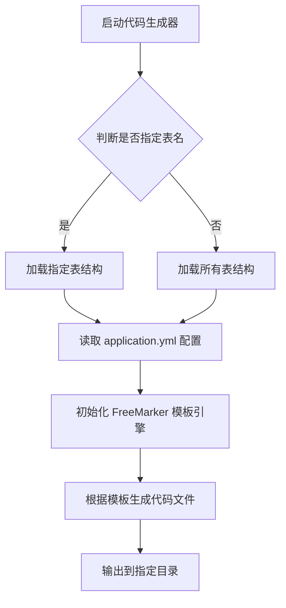

# 📚 Code-Generate 工程

## 🧾 项目简介

`code-generate` 是一个基于 Java 的代码生成工具，主要用于自动化生成数据库表对应的实体类、Mapper、Service 等基础代码，提升开发效率。该项目结合了 FreeMarker 模板引擎和 YAML 配置文件，支持灵活的模板配置与字段映射规则。
<p/>
备注：建议各位配合这篇博客来了解本代码生成框架：https://blog.csdn.net/weixin_63944437/article/details/148544114?spm=1011.2415.3001.5331

---

## 🛠️ 技术栈

| 技术 | 描述 |
|------|------|
| Java 8+ | 主要编程语言 |
| Spring Boot | 快速构建微服务框架 |
| FreeMarker | 模板引擎，用于代码生成 |
| YAML | 配置文件格式，配置数据库信息与生成参数 |
| Git | 版本控制工具 |
| Lombok | 简化 POJO 类的编写 |

---

## 📁 项目结构（示例）

```
code-generate/
├── src/
│   ├── main/
│   │   ├── java/
│   │   │   └── com.zhang.generate/
│   │   │       ├── config/            # 配置类
│   │   │       ├── bean/              # 实体类
│   │   │       ├── factory/           # 工厂类
│   │   │       ├── exception/         # 异常处理类
│   │   │       └── ...                # 其他业务逻辑类
│   │   │
│   │   └── resources/
│   │       ├── application.yml        # 应用配置文件
│   │       └── templates/             # FreeMarker 模板目录
│   │
└── pom.xml                            # Maven 项目配置文件
```


---

## ⚙️ 核心配置说明

### `application.yml`

```yaml
# mysql 相关配置
database:
    driver: com.mysql.cj.jdbc.Driver
    url: jdbc:mysql://127.0.0.1:3306/cloud_user?useUnicode=true&characterEncoding=utf-8&useSSL=false&serverTimezone=Asia/Shanghai
    username: root
    password:

# 需要生成的表名，默认为 * 代表所有表，多个表名以 , 分割
tableNames: "*"

# 表名前缀, 默认为 "*" 不去除前缀
tablePrefix: "*"

# 作者
author: zhanggongming

# 自定义前缀 eg: system
prefix: system

# 生成的代码 package 包名
packageName: com.zhang

# 是否只生成资源层 (DDD 架构专用属性)
onlyResource: false
```


---

## 🔑 核心类说明

### `GlobalConfig.java`

> **作用**：全局配置类，实现单例模式，负责加载配置信息和初始化 FreeMarker 模板引擎。

#### ✅ 核心方法：

- `public static ConfigInfo getConfigInfo()`

  使用双重检查锁定（Double-Checked Locking）实现线程安全的懒加载单例，调用 `PropertiesFactory.loadProperties()` 加载配置。

- `public static Configuration getConfiguration()`

  初始化并返回 FreeMarker 的配置对象，设置模板路径、编码、异常处理器等。

#### 💡 关键变量：

```java
private static volatile ConfigInfo INSTANCE = null;
private static volatile Configuration CONFIGURATION = null;
```


使用 `volatile` 保证多线程可见性，避免指令重排序问题。

---

### `PropertiesFactory.java`

> **作用**：读取 `application.yml` 配置文件，并将其解析为 [ConfigInfo](file://D:\download\project\tools\code-generate\src\main\java\com\zhang\generate\bean\ConfigInfo.java) 对象。

---

### `ConfigInfo.java`

> **作用**：封装从配置文件中读取的数据库连接信息、生成参数等。

包含如下字段：
- 数据库驱动、URL、用户名、密码
- 表名、表前缀、包名、作者名、是否仅生成资源层等

---

## 📄 代码生成流程图




---

## 📌 项目优势

- **高度可配置化**：通过 `application.yml` 可灵活配置数据库和生成规则。
- **模板驱动**：使用 FreeMarker 模板引擎，支持自定义代码结构。
- **轻量高效**：无复杂依赖，适合集成进已有项目或作为独立工具运行。
- **支持多种输出类型**：如 Entity、Mapper、Service、Controller 等。

---

## 📎 使用建议

- 在首次使用前，请确保 [application.yml](file://D:\download\project\tools\code-generate\src\main\resources\application.yml) 中的数据库连接信息正确。
- 如需自定义生成内容，可在 `resources/templates/` 下修改或新增 [.ftl](file://D:\download\project\tools\code-generate\src\main\resources\templates\generate-code\DDD\scene.ftl) 模板文件。
- 支持命令行执行，也可集成进 Spring Boot 启动类中。

---

## 📝 总结

`code-generate` 是一个实用的代码生成工具，能够显著减少重复性工作，提高开发效率。其设计简洁、配置灵活，非常适合中小型项目快速搭建基础代码结构。

--- 
